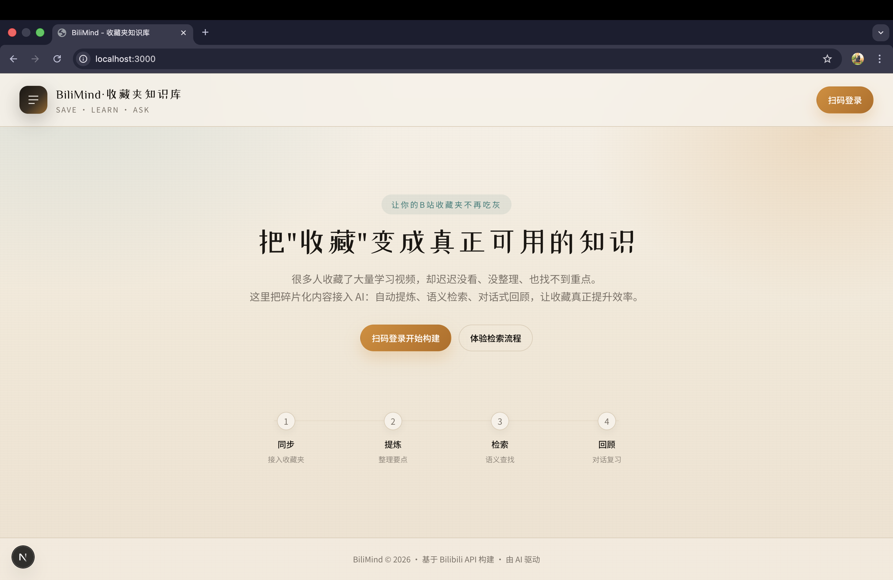

# BiliMind · 收藏夹知识库

> 把你在 B 站收藏的访谈/演讲/课程，变成可检索、可追溯来源的**个人知识库**
>
> Forked from [via007/bilibili-rag](https://github.com/via007/bilibili-rag) · 本分支包含前端质量审计与修复

---

## 功能一览

| 模块 | 说明 |
|------|------|
| 🔐 B站扫码登录 | 读取收藏夹列表 |
| 🎙️ 语音转文字 | ASR 自动兜底处理 |
| 🔍 语义检索 | ChromaDB 向量检索 |
| 💬 对话问答 | RAG 检索增强生成 |
| 💾 本地存储 | SQLite + ChromaDB |

---

## 工作流程

```
收藏夹 → 拉取视频 → 语音转写 → 向量入库 → 对话检索
```

1. **扫码登录** — B站 App 扫码授权
2. **选择收藏夹** — 拉取视频列表
3. **入库构建** — ASR 转写 + 向量 embedding
4. **对话问答** — 自然语言提问，AI 引用来源回答

---

## 快速开始

```bash
# 1. 安装依赖
pip install -r requirements.txt
npm install --prefix frontend

# 2. 配置环境变量
cp .env.example .env
# 编辑 .env，填写 DashScope API Key

# 3. 启动后端
python -m uvicorn app.main:app --reload
# API 文档：http://localhost:8000/docs

# 4. 启动前端
cd frontend && npm run dev
# 访问：http://localhost:3000
```

> ⚠️ 需要先安装 [ffmpeg](https://ffmpeg.org/) 并加入 PATH

---

## 项目结构

```
bilibili-rag/
├── app/                # FastAPI 后端
│   ├── routers/       # API 路由（认证/收藏夹/知识库/对话）
│   └── services/      # 核心服务（ASR/Bilibili/RAG）
├── frontend/           # Next.js 前端
│   ├── app/           # App Router + 全局样式
│   └── components/   # UI 组件
├── test/              # 诊断脚本
└── assets/           # 截图与演示
```

---

## 技术栈

| 层级 | 技术 |
|------|------|
| 前端 | Next.js 16 · React 19 · Tailwind CSS v4 · TypeScript |
| 后端 | FastAPI · LangChain |
| LLM | DashScope (通义千问) |
| 向量库 | ChromaDB |
| 数据库 | SQLite |

---

## 前端审计修复（本分支）

| 问题 | 修复 |
|------|------|
| QR码无 alt 文本 | 动态 alt 基于认证状态 |
| 用户区文字对比度低 | 修复为 WCAG AA |
| 流式对话状态抖动 | RAF 批量更新，~60fps |
| 全量客户端渲染 | page.tsx 拆分为 SSR + Client Component |
| 收藏夹展开键盘不可达 | div → button + ARIA 属性 |
| next.config 废弃配置 | 移除 env key |

> QA 测试通过 · 健康评分 100/100

---

## 截图




演示视频：[B站演示](https://b23.tv/bGXyhjU)

---

## Star History

[](https://star-history.com/#via007/bilibili-rag&Date)

---

## 常见问题

**Q: 为什么有些音频不可达？**
A: B站音频直链存在鉴权/过期/区域限制，系统会自动执行本地下载兜底流程。

**Q: DashScope 费用如何？**
A: 大多数模型有免费额度，日常使用通常足够。建议先用短视频测试。

---

> ⚠️ 本项目仅供个人学习与技术研究，使用者需自行遵守相关平台协议与法律法规。

MIT License
